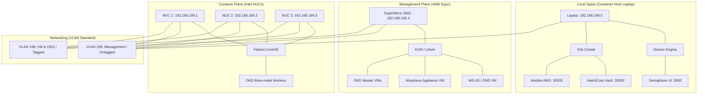

# Morpheus Enterprise Datacenter Lab

This project automates the setup of an immutable, enterprise-grade homelab using Ansible, Docker, K3s, and Morpheus.

## 🏗️ Infrastructure Architecture



## 🚀 Infrastructure Factory Services (Phase 1)

These services are hosted on the **Container Host Laptop** (192.168.199.5).

| Service | Access URL | Default Credentials |
| :--- | :--- | :--- |
| **Semaphore UI** | [http://192.168.199.5:3000](http://192.168.199.5:3000) | `bishop` / `Admin@12345` |
| **HashiCorp Vault UI** | [http://192.168.199.5:30002](http://192.168.199.5:30002) | (Requires Unseal Keys / Root Token) |
| **Ansible AWX UI** | [http://192.168.199.5:30005](http://192.168.199.5:30005) | `admin` / `Admin@12345` |

## 🛠️ Troubleshooting

### Resetting Semaphore Admin Password
If you're unable to log in to Semaphore, you can create a new admin user inside the container:
```bash
sudo docker exec -it bishop_semaphore-semaphore-1 semaphore user add --admin --name "Architect" --login "admin" --email "admin@homelab.local" --password "Admin@12345"
```

### Initializing and Unsealing Vault
Vault is initially **SEALED**. Run these commands on the laptop to initialize it:
```bash
export KUBECONFIG=/etc/rancher/k3s/k3s.yaml
kubectl exec -n vault -it vault-0 -- vault operator init
```
*Note: Securely save the Unseal Keys and Root Token provided by the output.*

### Monitoring AWX Deployment
AWX can take 5-10 minutes to initialize. Monitor the progress:
```bash
export KUBECONFIG=/etc/rancher/k3s/k3s.yaml
kubectl get pods -n awx -w
```

## 📜 Architectural Source of Truth
Refer to **`GEMINI.md`** for the full hardware inventory, networking standard, and bootstrapping sequence.
