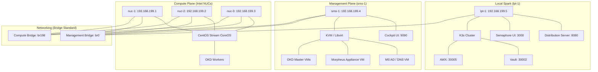

# Morpheus Enterprise Datacenter Lab

This project automates the setup of an immutable, enterprise-grade homelab using Ansible, Docker, K3s, and Morpheus.

## 🏗️ Infrastructure Architecture



## 📋 Infrastructure Inventory

### 🖥️ Physical Infrastructure
| Hostname | Role | Mgmt IP (VLAN 199) | Compute IP (VLAN 198) | Primary Hosting |
| :--- | :--- | :--- | :--- | :--- |
| **lpt-1** | Local Spark (Factory) | `192.168.199.5` | `192.168.198.5` | Semaphore, AWX, Vault, Nginx Dist |
| **sms-1** | Management Plane | `192.168.199.4` | `192.168.198.4` | KVM VMs (AD, Morpheus, OKD Masters) |
| **nuc-1** | OKD Worker 01 | `192.168.199.1` | `192.168.198.1` | OKD Bare-metal Compute |
| **nuc-2** | OKD Worker 02 | `192.168.199.2` | `192.168.198.2` | OKD Bare-metal Compute |
| **nuc-3** | OKD Worker 03 | `192.168.199.3` | `192.168.198.3` | OKD Bare-metal Compute |

### 🛠️ Virtualized Services & Nodes
| VM/Node Name | Role | IP Address | Hosted On |
| :--- | :--- | :--- | :--- |
| **identity-01** | MS Active Directory | `192.168.199.10` | `sms-1` (KVM) |
| **morpheus-01** | Morpheus Appliance | `192.168.199.11` | `sms-1` (KVM) |
| **okd-bootstrap**| OKD Cluster Bootstrap | `192.168.199.20` | `sms-1` (KVM) |
| **okd-master-01**| OKD Control Plane 01 | `192.168.199.21` | `sms-1` (KVM) |
| **okd-master-02**| OKD Control Plane 02 | `192.168.199.22` | `sms-1` (KVM) |
| **okd-master-03**| OKD Control Plane 03 | `192.168.199.23` | `sms-1` (KVM) |

## 🚀 Lab Management Services

| Service | Access URL | Default Credentials |
| :--- | :--- | :--- |
| **Semaphore UI** | [http://192.168.199.5:3000](http://192.168.199.5:3000) | `bishop` / `Admin@12345` |
| **Cockpit (sms-1)** | [https://192.168.199.4:9090](https://192.168.199.4:9090) | `bishop` / `Admin@12345` |
| **Distribution Server**| [http://192.168.199.5:8080](http://192.168.199.5:8080) | (Anonymous Read-only) |
| **Ansible AWX UI** | [http://192.168.199.5:30005](http://192.168.199.5:30005) | `admin` / `Admin@12345` |
| **HashiCorp Vault** | [http://192.168.199.5:30002](http://192.168.199.5:30002) | (Requires Unseal Keys) |

## 🛠️ Rebuild & Initialization Workflow

### 1. Day-0 Physical Install
Manual installation of **Ubuntu Server 24.04** on `lpt-1` and `sms-1` with static IPs and `bond0` (mode: active-backup).

### 2. Lab Initialization
Run the initialization playbook from the Dev Container to configure disks, networking (bridges/VLANs), and Factory services:
```bash
ansible-playbook -i inventory.yml playbooks/phase-0/playbook-lab-init.yml
```

### 3. Deploy Enterprise Core
Once initialized, run the subsequent phases to deploy Identity, Morpheus, and OKD:
- **Phase 3-1**: Deploy Active Directory.
- **Phase 4-1**: Deploy OKD Control Plane.

## 📜 Technical Standards

### Networking
- **Host-to-VM Connectivity**: Solved by using Linux Bridges (`br0`) instead of Macvtap.
- **VLAN Layering**: VLAN 198 is layered on `bond0` and bridged via `br198` for OKD traffic.

### Storage
- **lpt-1**: Secondary disk `/dev/sdb` is used for the distribution mirror (`/opt/distribution`).
- **sms-1**: NVMe disk `/dev/nvme0n1` is dedicated to VM storage (`/var/lib/libvirt/images`).

### OS & Kubernetes
- **OKD Stream**: OKD SCOS (CentOS Stream CoreOS) 4.19+.
- **Virtualization**: Libvirt/QEMU with `virt-manager` and `Cockpit` for GUI management.

## 🔓 Security Exceptions
- **AppArmor**: A surgical fix is applied to `/etc/apparmor.d/local/abstractions/libvirt-qemu` to allow Ignition metadata passing via `-fw_cfg`.

---
*Refer to **`GEMINI.md`** for the Master Bootstrapping Sequence and IP assignment tables.*
