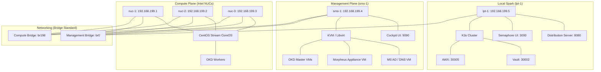

# Morpheus Enterprise Datacenter Lab

This project automates the setup of an immutable, enterprise-grade homelab using Ansible, Docker, K3s, and Morpheus.

## 🏗️ Infrastructure Architecture



## 📋 Infrastructure Inventory

### 🖥️ Physical Infrastructure
| Hostname | Role | Mgmt IP (VLAN 199) | Compute IP (VLAN 198) | Primary Hosting |
| :--- | :--- | :--- | :--- | :--- |
| **lpt-1** | Local Spark (Factory) | `192.168.199.5` | `192.168.198.5` | Semaphore, AWX, Vault, Nginx Dist |
| **sms-1** | Management Plane | `192.168.199.4` | `192.168.198.4` | KVM VMs (AD, Morpheus, OKD Masters) |
| **nuc-1** | OKD Worker 01 | `192.168.199.1` | `192.168.198.1` | OKD Bare-metal Compute |
| **nuc-2** | OKD Worker 02 | `192.168.199.2` | `192.168.198.2` | OKD Bare-metal Compute |
| **nuc-3** | OKD Worker 03 | `192.168.199.3` | `192.168.198.3` | OKD Bare-metal Compute |

### 🛠️ Virtualized Services & Nodes
| VM/Node Name | Role | IP Address | Hosted On |
| :--- | :--- | :--- | :--- |
| **identity-01** | MS Active Directory | `192.168.199.10` | `sms-1` (KVM) |
| **morpheus-01** | Morpheus Appliance | `192.168.199.11` | `sms-1` (KVM) |
| **okd-bootstrap**| OKD Cluster Bootstrap | `192.168.199.20` | `sms-1` (KVM) |
| **okd-master-01**| OKD Control Plane 01 | `192.168.199.21` | `sms-1` (KVM) |
| **okd-master-02**| OKD Control Plane 02 | `192.168.199.22` | `sms-1` (KVM) |
| **okd-master-03**| OKD Control Plane 03 | `192.168.199.23` | `sms-1` (KVM) |

## 🚀 Lab Management Services

| Service | Access URL | Default Credentials |
| :--- | :--- | :--- |
| **Semaphore UI** | [http://192.168.199.5:3000](http://192.168.199.5:3000) | `bishop` / `Admin@12345` |
| **Cockpit (sms-1)** | [https://192.168.199.4:9090](https://192.168.199.4:9090) | `bishop` / `Admin@12345` |
| **Distribution Server**| [http://192.168.199.5:8080](http://192.168.199.5:8080) | (Anonymous Read-only) |
| **Ansible AWX UI** | [http://192.168.199.5:30005](http://192.168.199.5:30005) | `admin` / `Admin@12345` |
| **HashiCorp Vault** | [http://192.168.199.5:30002](http://192.168.199.5:30002) | (Requires Unseal Keys) |

## 🎡 OKD Cluster Access

Once the OKD deployment is complete, use these commands on **lpt-1** to retrieve your credentials:

### 1. Get the Web Console URL
```bash
export KUBECONFIG=/opt/okd-cluster/auth/kubeconfig
oc get route -n openshift-console console -o jsonpath='{.spec.host}'
```

### 2. Get the Admin Credentials
- **Username:** `kubeadmin`
- **Password:**
  ```bash
  sudo cat /opt/okd-cluster/auth/kubeadmin-password
  ```

## 🛠️ Monitoring & Troubleshooting

Use these commands on **lpt-1** to track deployment progress and resolve common issues:

### 1. Watch Node Status
Monitor when nodes join the cluster and reach "Ready" status:
```bash
export KUBECONFIG=/opt/okd-cluster/auth/kubeconfig
watch -n 5 "oc get nodes"
```

### 2. Check and Approve Certificates (CSRs)
If nodes are stuck in `Pending` or `NotReady`, they likely need certificate approval:
```bash
# List pending requests
oc get csr
# Approve all pending requests
oc get csr -o name | xargs oc adm certificate approve
```

### 3. Verify Cluster Health (Operators)
Check if the "brains" of the cluster are healthy (Console, API, Ingress):
```bash
oc get clusteroperators
```

### 4. Debug Pod/VM Scheduling Issues
If a Pod or VM is stuck in `Pending`, check the internal events for the reason:
```bash
# For Pods
oc describe pod <pod_name> -n <namespace> | tail -n 20
# For Virtual Machines
oc describe vmi <vm_name> -n <namespace> | tail -n 20
```

### 5. Check Load Balancer Status
Verify if HAProxy is correctly seeing the backend nodes:
```bash
ansible lpt-1 -i inventory.yml -m shell -a "systemctl status haproxy -l" --become
```

## ⏳ Post-Deployment Stabilization

After the "Wait & Handoff" playbook completes, the cluster often enters a **Revision Rollout** phase. During this time, `oc get clusteroperators` may report `Degraded` or `False`. This is normal.

### How to confirm health:
Watch the API server pods to see them cycle through revisions (e.g., Revision 8 to Revision 9):
```bash
oc get pods -n openshift-kube-apiserver
```
*   **Wait** until all `installer-X` pods are **`Completed`**.
*   **Wait** until all `kube-apiserver-okd-master-XX` pods are **`Running` (5/5)**.
*   **Wait** until all `guard` pods are **`Running` (1/1)**.

Once the API rollout finishes, the remaining operators (Monitoring, Authentication, Console) will automatically turn **Green**.

## 🏗️ OKD Virtualization & Storage (Post-Install)

After deploying the KubeVirt HyperConverged Operator, follow these steps to enable local storage on NUC Workers:

### 1. Prepare Worker Node Storage (SELinux)
Run these commands on **lpt-1** for each worker node to allow HostPath writes:
```bash
oc debug node/okd-worker-01.homelab.local -- chroot /host /bin/bash -c "mkdir -p /var/hpvolumes && chcon -R -t container_file_t /var/hpvolumes"
oc debug node/okd-worker-02.homelab.local -- chroot /host /bin/bash -c "mkdir -p /var/hpvolumes && chcon -R -t container_file_t /var/hpvolumes"
oc debug node/okd-worker-03.homelab.local -- chroot /host /bin/bash -c "mkdir -p /var/hpvolumes && chcon -R -t container_file_t /var/hpvolumes"
```

### 2. Configure HostPath Provisioner (HPP)
Create the `HostPathProvisioner` resource in the `kubevirt-hyperconverged` namespace:
```yaml
apiVersion: hostpathprovisioner.kubevirt.io/v1beta1
kind: HostPathProvisioner
metadata:
  name: hostpath-provisioner
spec:
  imagePullPolicy: IfNotPresent
  pathConfig:
    path: "/var/hpvolumes"
    useNamingPrefix: false
  workload:
    nodeSelector:
      node-role.kubernetes.io/worker: ""
```

### 3. Create StorageClass
Create the `hostpath-virt` StorageClass and set it as default:
```yaml
apiVersion: storage.k8s.io/v1
kind: StorageClass
metadata:
  name: hostpath-virt
  annotations:
    storageclass.kubernetes.io/is-default-class: "true"
provisioner: kubevirt.io.hostpath-provisioner
reclaimPolicy: Delete
volumeBindingMode: WaitForFirstConsumer
```

### 4. Configure Virtual Networking (NMState)

This connects internal VMs to your physical network (`192.168.199.x`) using a secondary bridge called `br-ext`.

#### A. Install NMState Operator (from lpt-1)
```bash
oc apply -f https://github.com/nmstate/kubernetes-nmstate/releases/download/v0.86.0/nmstate.io_nmstates.yaml
oc apply -f https://github.com/nmstate/kubernetes-nmstate/releases/download/v0.86.0/namespace.yaml
oc apply -f https://github.com/nmstate/kubernetes-nmstate/releases/download/v0.86.0/service_account.yaml
oc apply -f https://github.com/nmstate/kubernetes-nmstate/releases/download/v0.86.0/role.yaml
oc apply -f https://github.com/nmstate/kubernetes-nmstate/releases/download/v0.86.0/role_binding.yaml
oc apply -f https://github.com/nmstate/kubernetes-nmstate/releases/download/v0.86.0/operator.yaml

# Trigger the engine
cat <<EOF | oc create -f -
apiVersion: nmstate.io/v1
kind: NMState
metadata:
  name: nmstate
EOF
```

#### B. Create the External Bridge (br-ext)
```bash
cat <<EOF | oc apply -f -
apiVersion: nmstate.io/v1
kind: NodeNetworkConfigurationPolicy
metadata:
  name: br-ext-nucs
spec:
  nodeSelector:
    node-role.kubernetes.io/worker: ""
  desiredState:
    interfaces:
      - name: br-ext
        type: linux-bridge
        state: up
        bridge:
          options:
            stp:
              enabled: false
          port:
            - name: enp1s0
EOF
```

#### C. Restore Static IPs (Manual Recovery)
When the bridge is created, the Workers will drop to DHCP. Log into each **Worker Console** via Cockpit and run:
```bash
# Replace .XX with .31, .32, or .33
sudo nmcli connection modify br-ext ipv4.addresses 192.168.199.XX/24 ipv4.gateway 192.168.199.254 ipv4.dns "192.168.199.10 192.168.1.1" ipv4.method manual && sudo nmcli connection up br-ext
```

#### D. Create the "Plug" (NAD)
Create this in the `default` namespace (or wherever your VMs live):
```bash
cat <<EOF | oc apply -f -
apiVersion: "k8s.cni.cncf.io/v1"
kind: NetworkAttachmentDefinition
metadata:
  name: bridge-conf
  namespace: default
spec:
  config: '{
      "cniVersion": "0.3.1",
      "name": "bridge-conf",
      "type": "bridge",
      "bridge": "br-ext",
      "ipam": {}
    }'
EOF
```

## 🛠️ Rebuild & Initialization Workflow

### 1. Day-0 Physical Install
Manual installation of **Ubuntu Server 24.04** on `lpt-1` and `sms-1` with static IPs and `bond0` (mode: active-backup).

### 2. Lab Initialization
Run the initialization playbook from the Dev Container to configure disks, networking (bridges/VLANs), and Factory services:
```bash
ansible-playbook -i inventory.yml playbooks/phase-0/playbook-lab-init.yml
```

### 3. Deploy Enterprise Core
Once initialized, run the subsequent phases to deploy Identity, Morpheus, and OKD:
- **Phase 3-1**: Deploy Active Directory.
- **Phase 4-1**: Deploy OKD Control Plane.

## 📜 Technical Standards

### Networking
- **Host-to-VM Connectivity**: Solved by using Linux Bridges (`br0`) instead of Macvtap.
- **VLAN Layering**: VLAN 198 is layered on `bond0` and bridged via `br198` for OKD traffic.

### Storage
- **lpt-1**: Secondary disk `/dev/sdb` is used for the distribution mirror (`/opt/distribution`).
- **sms-1**: NVMe disk `/dev/nvme0n1` is dedicated to VM storage (`/var/lib/libvirt/images`).

### OS & Kubernetes
- **OKD Stream**: OKD SCOS (CentOS Stream CoreOS) 4.19+.
- **Virtualization**: Libvirt/QEMU with `virt-manager` and `Cockpit` for GUI management.

## 🔓 Security Exceptions
- **AppArmor**: A surgical fix is applied to `/etc/apparmor.d/local/abstractions/libvirt-qemu` to allow Ignition metadata passing via `-fw_cfg`.

---
*Refer to **`GEMINI.md`** for the Master Bootstrapping Sequence and IP assignment tables.*
